<!--Header-->
<h2 align="left" style="padding-top: 1.5rem; font-family: monospace;">
    <samp>About me</samp>
</h2>

    
    

        <samp>
            Hello! My name is Fulvio, also known as Ercaino.
              
            I am a 19 year old Italian student, passionate about IT since childhood. 
            I recently started a serious journey in software development and cybersecurity, areas that stimulate and motivate me every day to improve.
              
            I enjoy creating well-structured and functional open source software, following clean and safe coding practices.
             
            I am a perfectionist person and strongly oriented towards continuous improvement: I never stop learning and trying to grow professionally.
               
            I am open to collaborations and contributions on interesting projects, and I always welcome constructive feedback to improve my work. Feel free to contact me!
        </samp>
    

    

        
        
        
    

 

<!-- Social -->
<h2 align="left">  Social and contact </h2>

    
    
    
    
    
    
    
    
    
    
    <!--  -->

 

<!-- Stack -->
<h2 align="left">  My stack </h2>

    
<strong>Languages :</strong>

    

        
    

    

        
        
        
        
        
        
        
        
        
        <!--  -->
        <!--  -->
        <!--  -->
        <!--  -->
        <!--  -->
        <!--  -->
        <!--  -->
        <!--  -->
        <!--  -->
    

    

        
        
        
    

    
<strong>Frameworks and Library :</strong>

    

        
    

    

        
        
        
        
    

    

        
    

    

        
    

     
    
<strong>Other tools :</strong>

    

        
    

    

        
    

    

        
        
        
        
        
        
        
        
        
        
    

    

        
        
    

    
<strong>Operating System :</strong>

    

        
    

 

<!-- Certification -->
<h2 align="left">  Cisco Certifications </h2>

    

        
    

 

<!-- Stats git -->
<h2 align="left">  Stast </h2>

<!-- gruvbox _ juicyfresh --> 
<!-- &column=3&margin-w=15&margin-h=15 -->
<!-- 

    

        

            
    

     

 -->

    

        
        

            
        
 
        

            
        
  
    

    

        

        

    

<!--
**Ercaino/Ercaino** is a ✨ _special_ ✨ repository because its `README.md` (this file) appears on your GitHub profile.

Here are some ideas to get you started:

- 🔭 I’m currently working on ...
- 🌱 I’m currently learning ...
- 👯 I’m looking to collaborate on ...
- 🤔 I’m looking for help with ...
- 💬 Ask me about ...
- 📫 How to reach me: ...
- 😄 Pronouns: ...
- ⚡ Fun fact: ...
-->